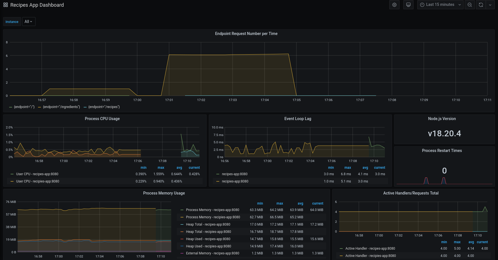
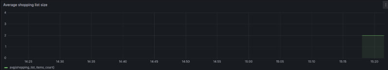
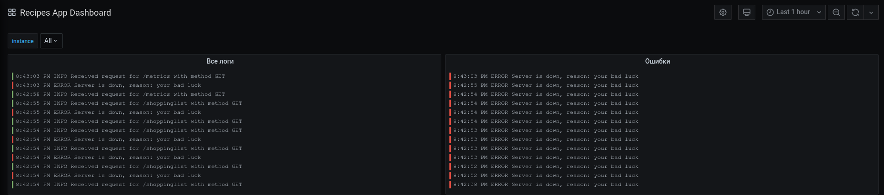
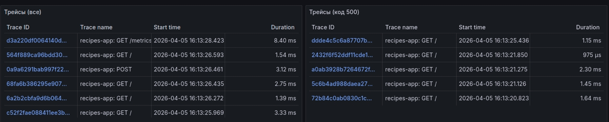

# Приложение для хранения кулинарных рецептов и планирования покупок

Сгенерировано на основе .yaml файла в папке api

# Запуск

> docker-compose up

- Сервер запустится на порту 8080
- Prometheus запустится на порту 8081
- Grafana запустится на порту 8082

# Спецификация

https://github.com/Katerina-03/recipes-book/blob/main/api/openapi.yaml

# Swagger
https://github.com/Katerina-03/recipes-book/blob/main/%D0%9B%D0%A0-2.pdf

# Метрики

Prometheus + Grafana
- стандартные метрики NodeJS приложений https://github.com/Katerina-03/recipes-book/blob/main/index.js#L18
- пользовательская метрика "Число запросов" https://github.com/Katerina-03/recipes-book/blob/main/index.js#L26
- пользовательская метрика "Среднее число товаров в списке покупок" https://github.com/Katerina-03/recipes-book/blob/main/index.js#L32
- Для того чтобы Prometheus мог собирать метрики, в приложении реализован эндпоинт /metrics: https://github.com/Katerina-03/recipes-book/blob/main/index.js#L67
- панель создается автоматически
- язык запросов - promQL. Пример: https://github.com/Katerina-03/recipes-book/blob/main/grafana/dashboards/dashboard.json#L331

Пример панели:

# Логи

Loki + Promtail
- вывод всех логов
- вывод только логов уровня "ошибка" (имитируется с некоторой вероятностью при запросе на любой эндпоинт)

Пример панели:

# Трейсы
Jaeger

- все трейсы
- трейсы с кодом 500

Пример панели:
